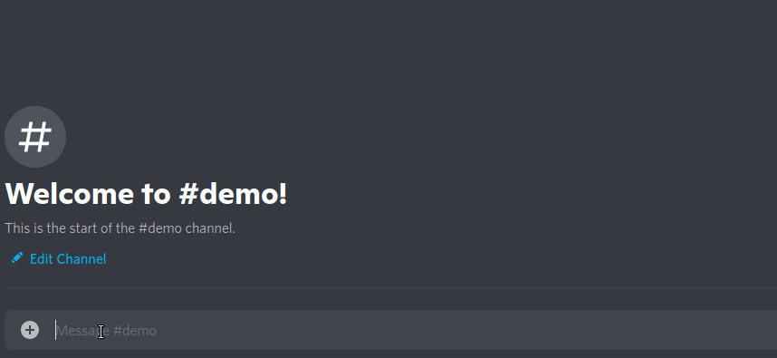

# SecretLatexBot

A Discord bot that detects inline LaTeX between `$||` and `||` and sends the resulting LaTeX in a spoiler image. For example, in `Here is $||3||`, 3 will be detected and sent in a spoiler image.

This bot uses [Sharp](https://sharp.pixelplumbing.com/) and [MathJax](https://github.com/mathjax/MathJax-node) on the backend to convert LaTeX to an image.

This bot is licensed under AGPLv3 - what this means is that (among other things), you can modify, redistribute, and use this bot however you want, as long as you make the source available to whoever is using the bot, and as long as you retain copyright license notices in the code. A convenient way of doing this is to change the `SRC_LOC` variable in `app.ts` accordingly.

## License

Copyright (C) 2021 Sahan Kumarasinghe

This program is free software: you can redistribute it and/or modify
it under the terms of the GNU Affero General Public License as
published by the Free Software Foundation, either version 3 of the
License, or (at your option) any later version.

This program is distributed in the hope that it will be useful,
but WITHOUT ANY WARRANTY; without even the implied warranty of
MERCHANTABILITY or FITNESS FOR A PARTICULAR PURPOSE.  See the
GNU Affero General Public License for more details.

You should have received a copy of the GNU Affero General Public License
along with this program.  If not, see <https://www.gnu.org/licenses/>.
